---
## Front matter
lang: ru-RU
title: Лабораторная работа №1. 
subtitle: Julia. Установка и настройка. Основные принципы.
author:
  - Тазаева А. А.
institute:
  - Российский университет дружбы народов, Москва, Россия

## i18n babel
babel-lang: russian
babel-otherlangs: english

## Formatting pdf
toc: false
toc-title: Содержание
slide_level: 2
aspectratio: 169
section-titles: true
theme: metropolis
header-includes:
 - \metroset{progressbar=frametitle,sectionpage=progressbar,numbering=fraction}
---

# Цели работы

Подготовить рабочее пространство и инструментарий для работы с языком программирования Julia, на простейших примерах познакомиться с основами синтаксиса Julia.

# Задание

1. Установить под свою операционную систему Julia, Jupyter.
2. Используя Jupyter Lab, повторите простейшие примеры с синтаксисом Julia.
3. Выполните задания для самостоятельной работы.

## Установка необходимого программного обеспечения

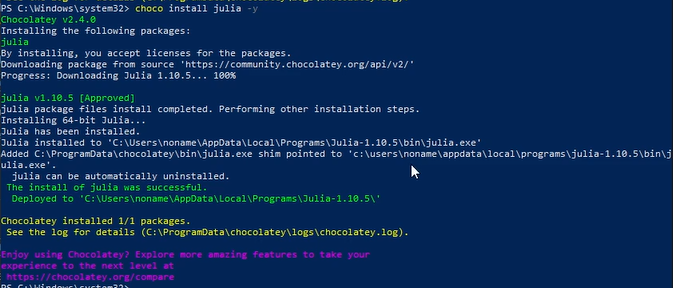{#fig:004 width=70%}

## Установка необходимого программного обеспечения

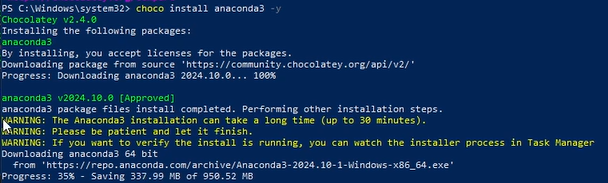{#fig:005 width=70%}

## Основы работы в блокноте Jupyter

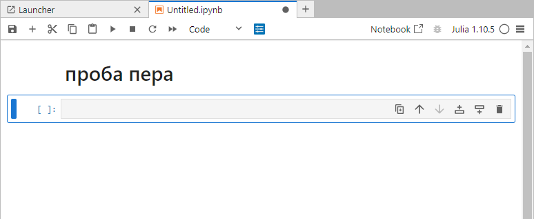{#fig:007 width=70%}

## Основы работы в блокноте Jupyter

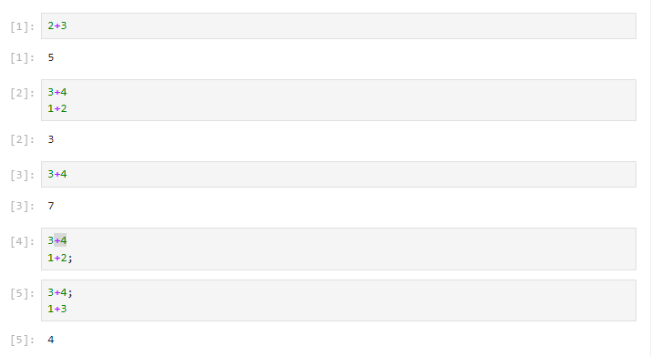{#fig:008 width=70%}

## Повторение примеров из раздела 1.3.3

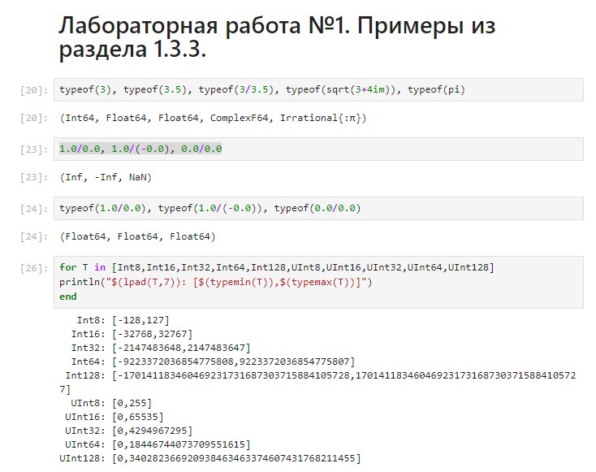{#fig:011 width=70%}

## Повторение примеров из раздела 1.3.3

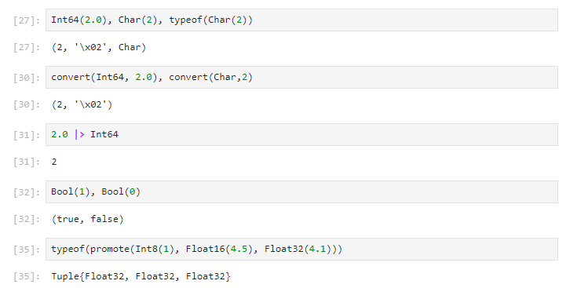{#fig:012 width=70%}

## Самостоятельная работа. Задание 1

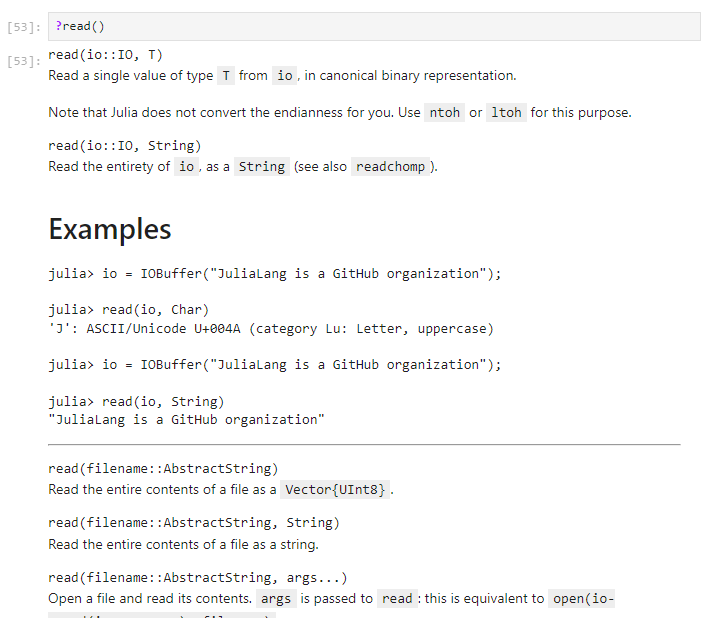{#fig:015 width=70%}

## Самостоятельная работа. Задание 1

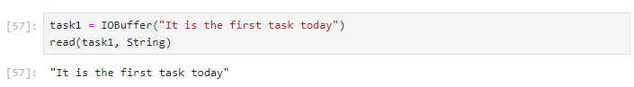{#fig:016 width=70%}

## Самостоятельная работа. Задание 2

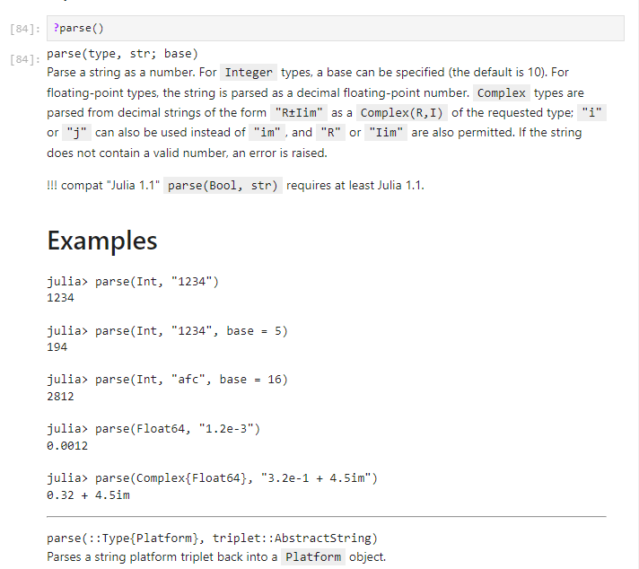{#fig:030 width=70%}

## Самостоятельная работа. Задание 2

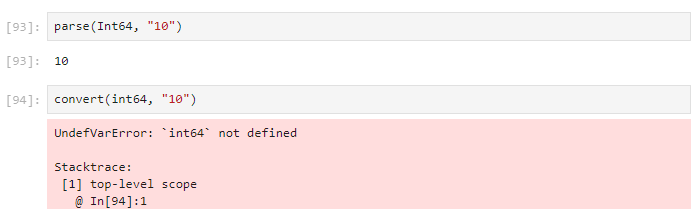{#fig:031 width=70%}

## Самостоятельная работа. Задание 3

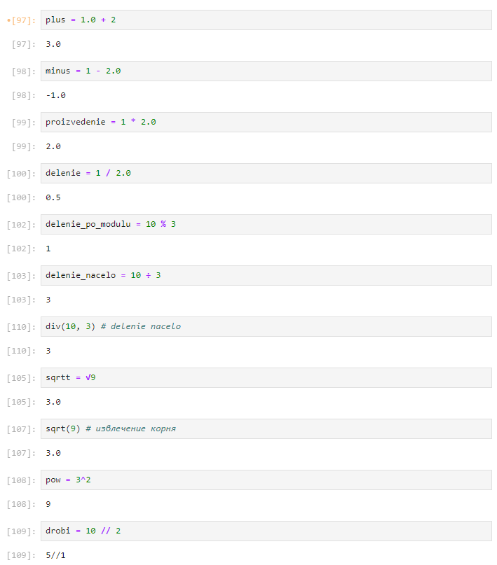{#fig:032 width=70%}

## Самостоятельная работа. Задание 4

{#fig:032 width=70%}

# Выводы по проделанной работе

В ходе лабораторной работы мной было подготовлено рабочее пространство и инструментарий для работы с языком программирования Julia, также я познакомилась с основами синтаксиса Julia на простейших примерах.

