---
## Front matter
title: "Лабораторная работа №1"
subtitle: "Julia. Установка и настройка. Основные принципы."
author: "Тазаева Анастасия Анатольевна"

## Generic otions
lang: ru-RU
toc-title: "Содержание"

## Bibliography
bibliography: bib/cite.bib
csl: pandoc/csl/gost-r-7-0-5-2008-numeric.csl

## Pdf output format
toc: true # Table of contents
toc-depth: 2
lof: true # List of figures
lot: true # List of tables
fontsize: 12pt
linestretch: 1.5
papersize: a4
documentclass: scrreprt
## I18n polyglossia
polyglossia-lang:
  name: russian
  options:
	- spelling=modern
	- babelshorthands=true
polyglossia-otherlangs:
  name: english
## I18n babel
babel-lang: russian
babel-otherlangs: english
## Fonts
mainfont: IBM Plex Serif
romanfont: IBM Plex Serif
sansfont: IBM Plex Sans
monofont: IBM Plex Mono
mathfont: STIX Two Math
mainfontoptions: Ligatures=Common,Ligatures=TeX,Scale=0.94
romanfontoptions: Ligatures=Common,Ligatures=TeX,Scale=0.94
sansfontoptions: Ligatures=Common,Ligatures=TeX,Scale=MatchLowercase,Scale=0.94
monofontoptions: Scale=MatchLowercase,Scale=0.94,FakeStretch=0.9
mathfontoptions:
## Biblatex
biblatex: true
biblio-style: "gost-numeric"
biblatexoptions:
  - parentracker=true
  - backend=biber
  - hyperref=auto
  - language=auto
  - autolang=other*
  - citestyle=gost-numeric
## Pandoc-crossref LaTeX customization
figureTitle: "Рис."
tableTitle: "Таблица"
listingTitle: "Листинг"
lofTitle: "Список иллюстраций"
lotTitle: "Список таблиц"
lolTitle: "Листинги"
## Misc options
indent: true
header-includes:
  - \usepackage{indentfirst}
  - \usepackage{float} # keep figures where there are in the text
  - \floatplacement{figure}{H} # keep figures where there are in the text
---

# Цель работы

Подготовить рабочее пространство и инструментарий для работы с языком программирования Julia, на простейших примерах познакомиться с основами синтаксиса Julia.

# Задание

1. Установите под свою операционную систему Julia, Jupyter (разделы 1.3.1 и 1.3.2).
2. Используя Jupyter Lab, повторите примеры из раздела 1.3.3.
3. Выполните задания для самостоятельной работы (раздел 1.3.4).

# Выполнение лабораторной работы

## Установка необходимого программного обеспечения 

1. Для дальнейшей работы с лабораторными занятиями нам понадобится установить несколько приложений. Для этого установим Chocolatey (рис. [-@fig:001]), Far (рис. [-@fig:002]), Notepad++ (рис. [-@fig:003]), Julia (рис. [-@fig:004]), Anaconda3 (рис. [-@fig:005]) с помощью комманд:

```
Set-ExecutionPolicy Bypass -Scope Process -Force; [System.Net.ServicePointManager]::SecurityProtocol = [System.Net.ServicePointManager]::SecurityProtocol -bor 3072; iex ((New-Object System.Net.WebClient).DownloadString('https://community.chocolatey.org/install.ps1'))

choco install far

choco install notepadplusplus

choco install julia

choco install anaconda3

```

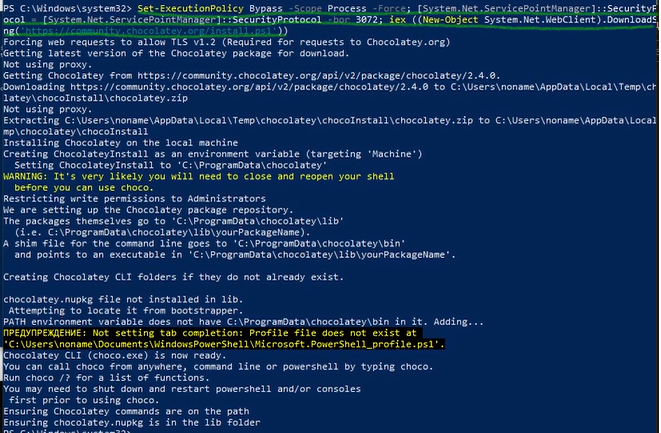{#fig:001 width=70%}

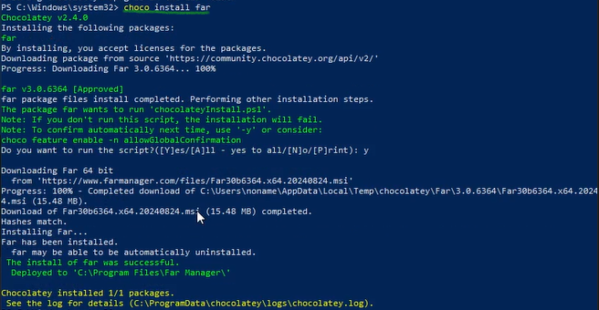{#fig:002 width=70%}

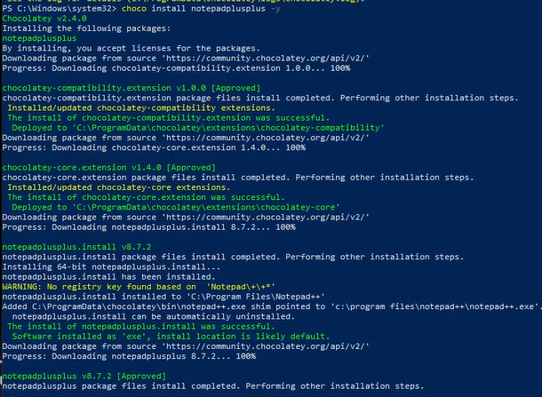{#fig:003 width=70%}

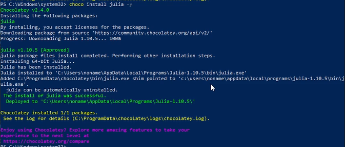{#fig:004 width=70%}

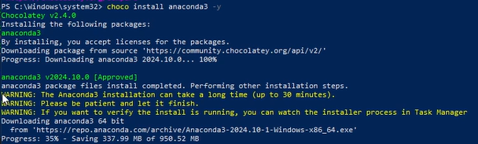{#fig:005 width=70%}

2. Также установим пакет IJulia (рис. [-@fig:006]) для работы в Jupyter :

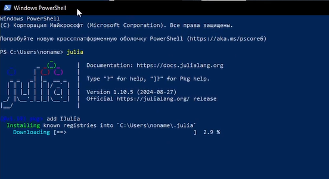{#fig:006 width=70%}

## Основы работы в блокноте Jupyter

1. Создала файл, указала ядро Julia 1.10.15 (рис. [-@fig:007]), далее опробовала комбинации клавиш, представленные в файле лаб.работы 

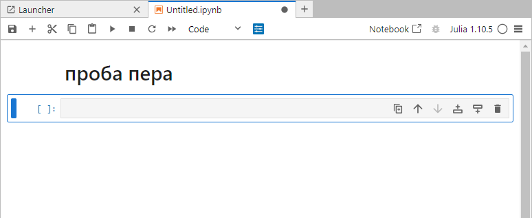{#fig:007 width=70%}

2. Выполнила простейшие операции на языке Julia в Jupyter Lab (рис. [-@fig:008])

{#fig:008 width=70%}

3. С помощью команды `?` получила информацию по функции (рис. [-@fig:009]):

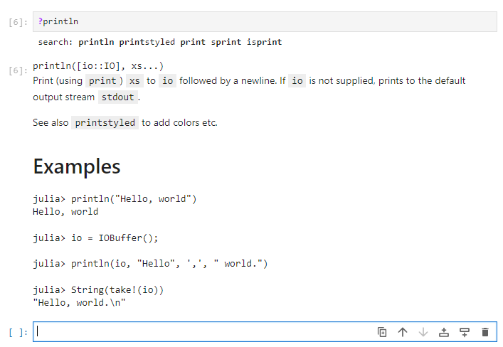{#fig:009 width=70%}

4. С помощью команды `;` получила информацию о пользователе. Эта команда может использовать команды из командной оболочки вашей операционной системы (рис. [-@fig:010]):

{#fig:010 width=70%}

## Повторение примеров из раздела 1.3.3

1. Узнала как определять тип данных (рис. [-@fig:011]), как конвертировать данные (рис. [-@fig:012]), как создавать функции (рис. [-@fig:013]), как создавать матрицы, также провела операции над матрицами (рис. [-@fig:014]).

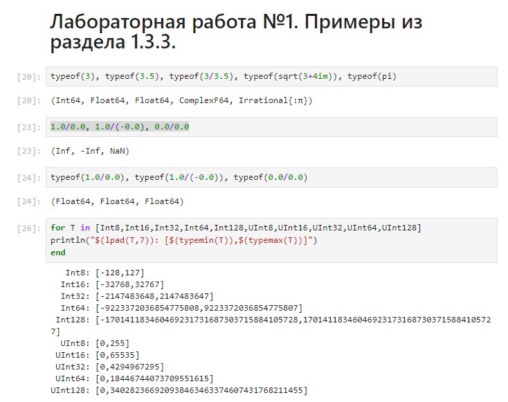{#fig:011 width=70%}

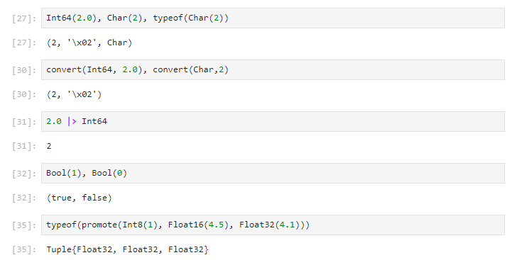{#fig:012 width=70%}

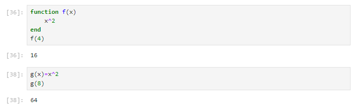{#fig:013 width=70%}

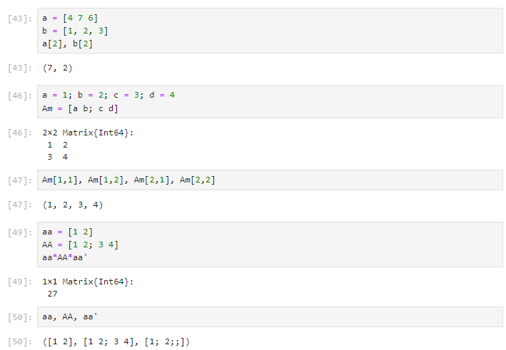{#fig:014 width=70%}

## Самостоятельная работа

1. Изучила документацию по основным функциям Julia для чтения / записи / вывода информации на экран и привела свои примеры их использования: 

- read() (рис. [-@fig:015] и  [-@fig:016]);

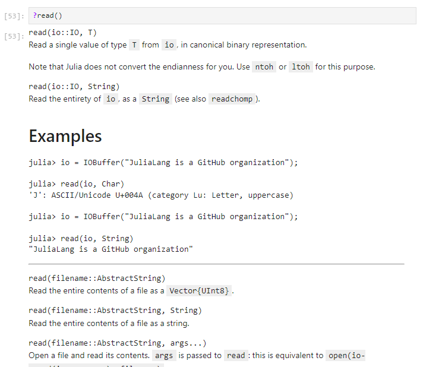{#fig:015 width=70%}

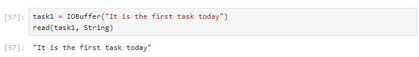{#fig:016 width=70%}

- readline() (рис. [-@fig:017] и [-@fig:018]); 

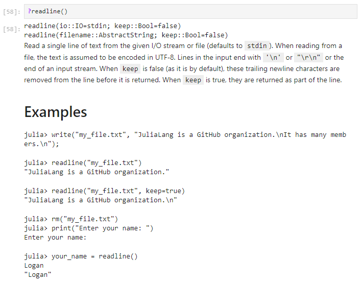{#fig:017 width=70%}

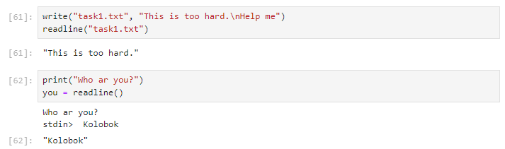{#fig:018 width=70%}

- readlines() (рис. [-@fig:019] и [-@fig:020]); 

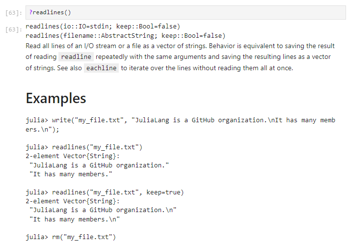{#fig:019 width=70%}

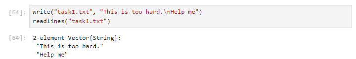{#fig:020 width=70%}

- readdlm() (рис. [-@fig:021]). Здесь информация не была предоставлена, потому и нет примера; 

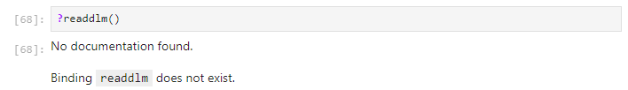{#fig:021 width=70%}

- print() (рис. [-@fig:022] и [-@fig:023]);

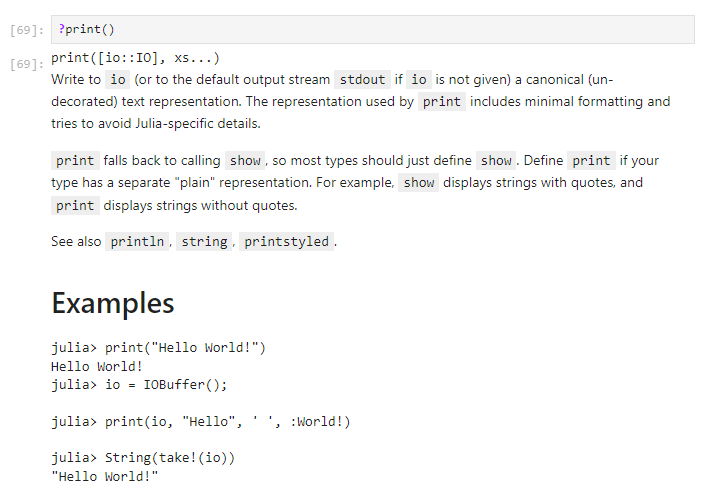{#fig:022 width=70%}

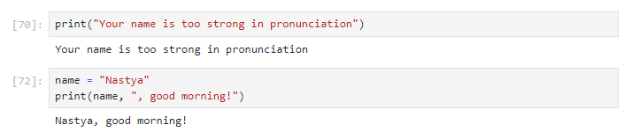{#fig:023 width=70%}

- println() (рис. [-@fig:024] и [-@fig:025]); 

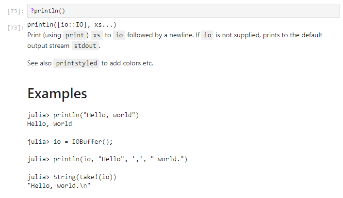{#fig:024 width=70%}

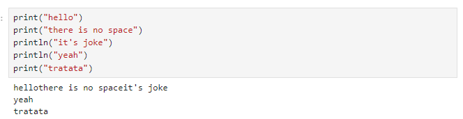{#fig:025 width=70%}

- show() (рис. [-@fig:026] и [-@fig:027]); 

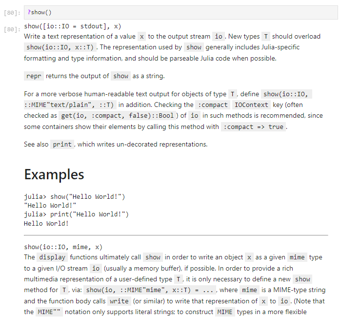{#fig:026 width=70%}

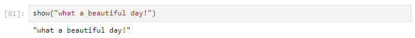{#fig:027 width=70%}

- write() (рис. [-@fig:028] и [-@fig:029]). 

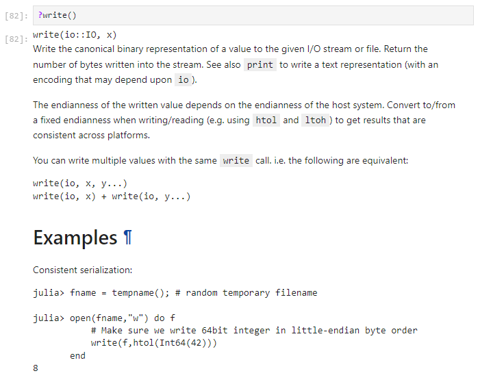{#fig:028 width=70%}

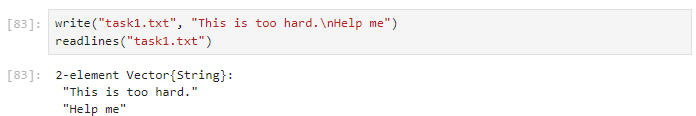{#fig:029 width=70%}

2. Изучила документацию по функции parse() (рис. [-@fig:030]). Приведила свои примеры её использования. На рис. [-@fig:031] видно, что тип строки не получается конвертировать, потому сначала его нужна спарсить.

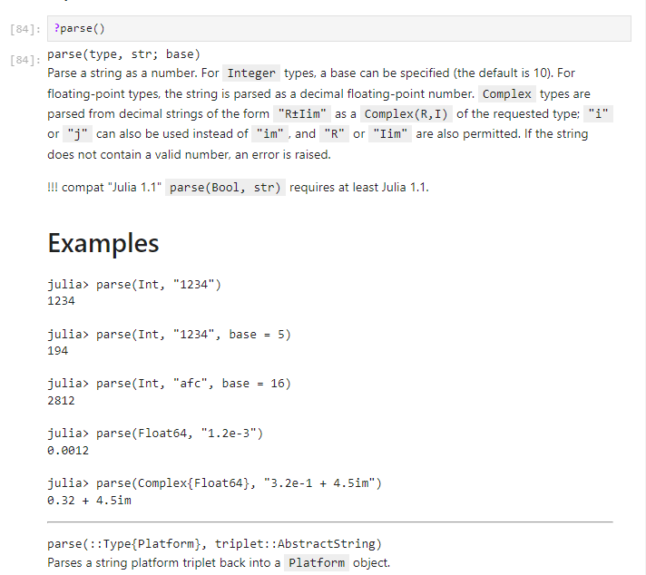{#fig:030 width=70%}

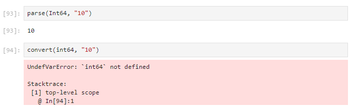{#fig:031 width=70%}

3. Изучила синтаксис Julia для базовых математических операций с разным типом переменных: сложение, вычитание, умножение, деление, возведение в степень, извлечение корня, сравнение, логические операции. Привела свои примеры с пояснениями по особенностям их применения (рис. [-@fig:032]).

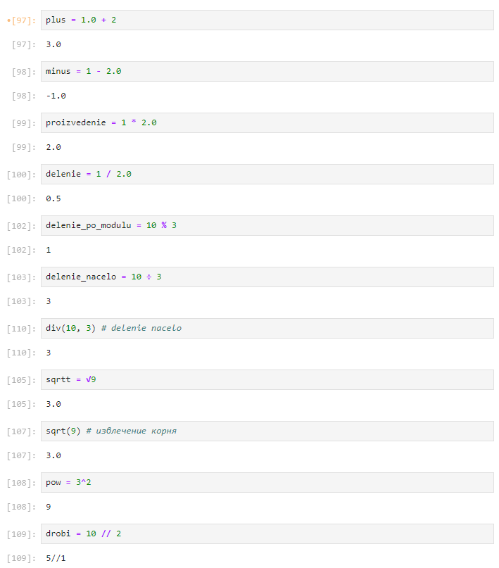{#fig:032 width=70%}

4. Привела несколько своих примеров с пояснениями с операциями над матрицами и векторами: сложение, вычитание, скалярное произведение, транспонирование, умножение на скаляр (рис. [-@fig:033]).

{#fig:033 width=70%}

# Выводы

В ходе лабораторной работы мной было подготовлено рабочее пространство и инструментарий для работы с языком программирования Julia, также я познакомилась с основами синтаксиса Julia на простейших примерах.

