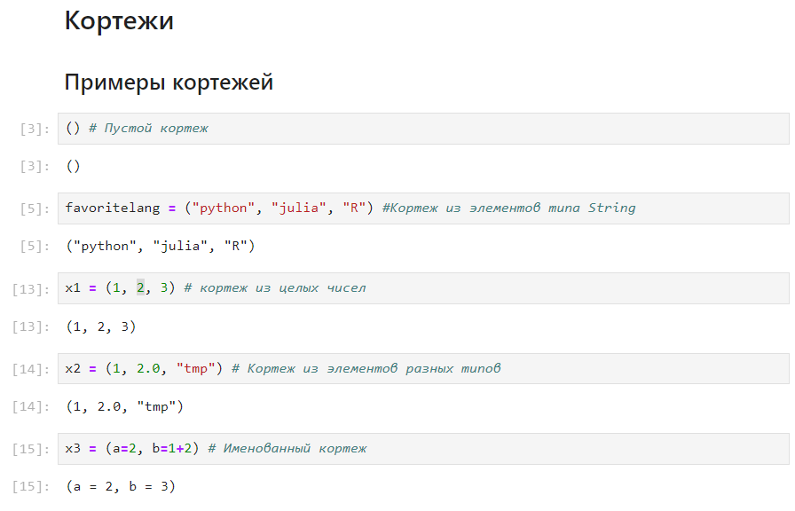
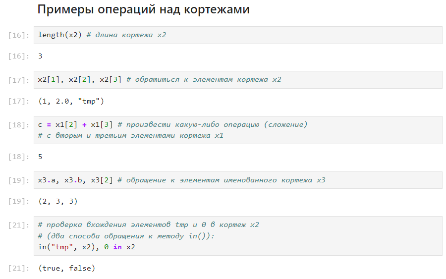
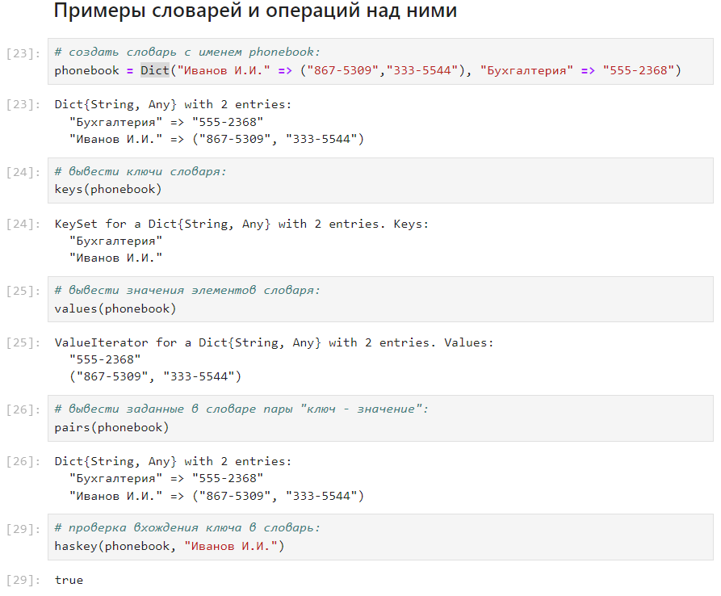
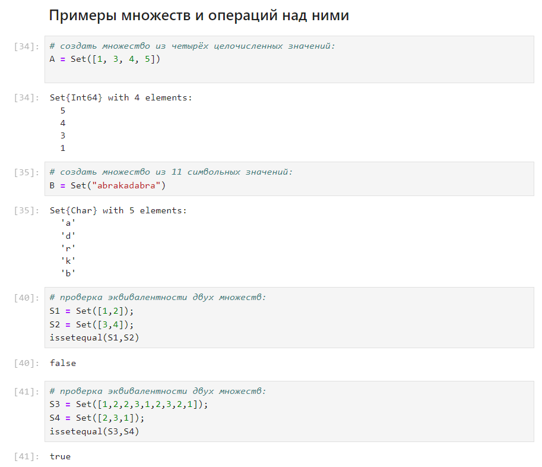
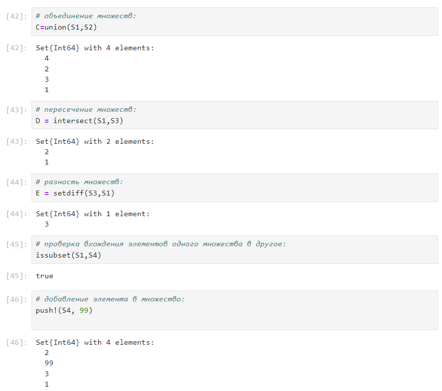
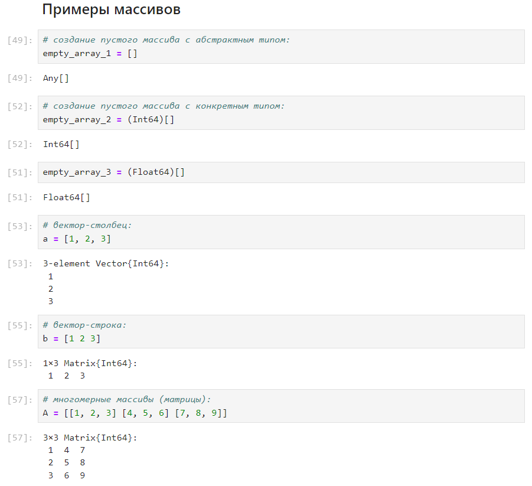
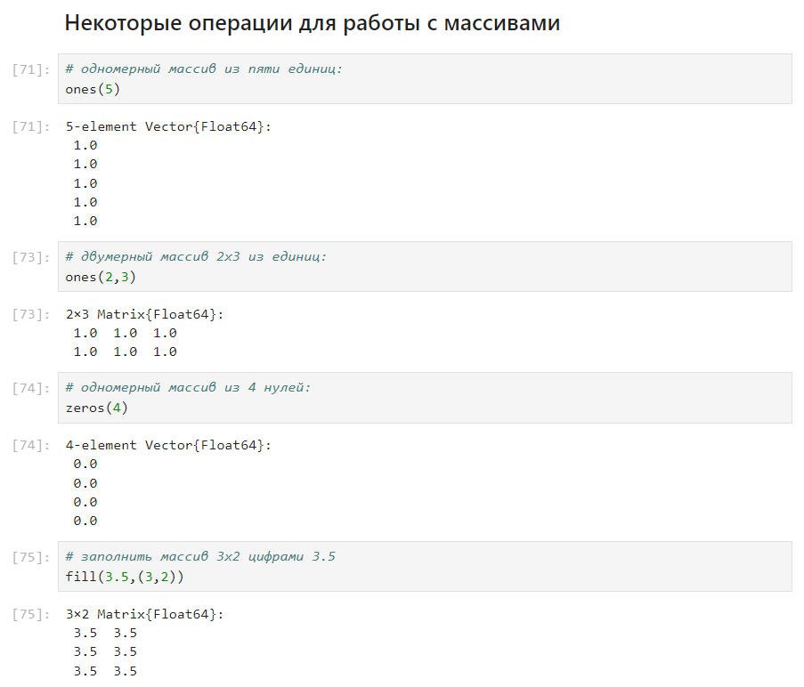
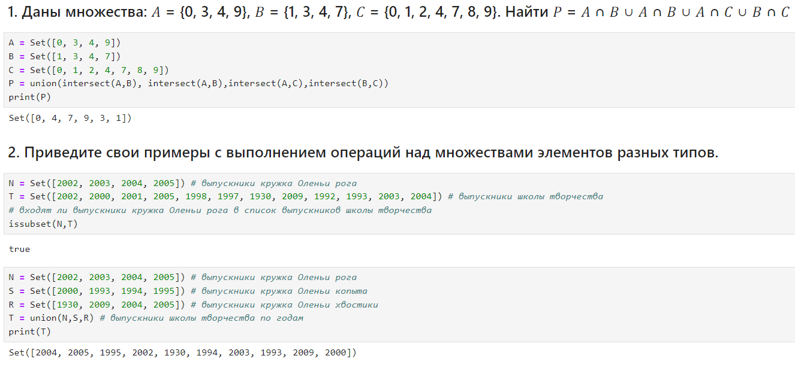
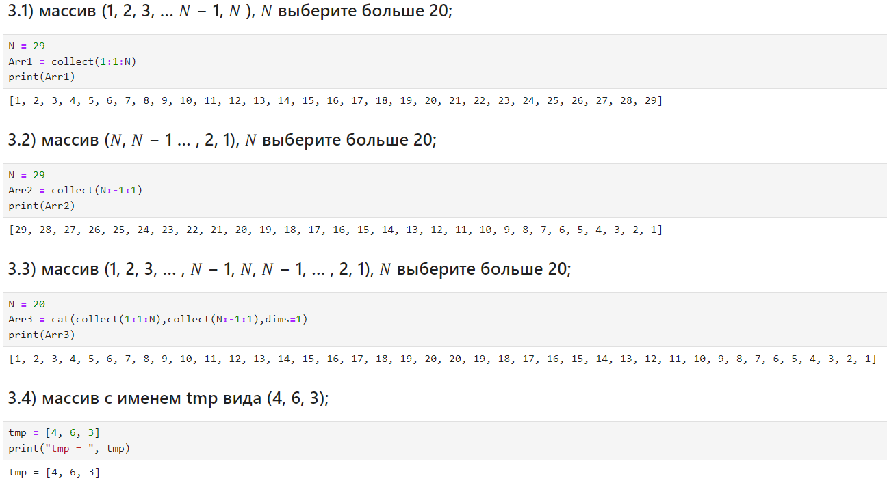
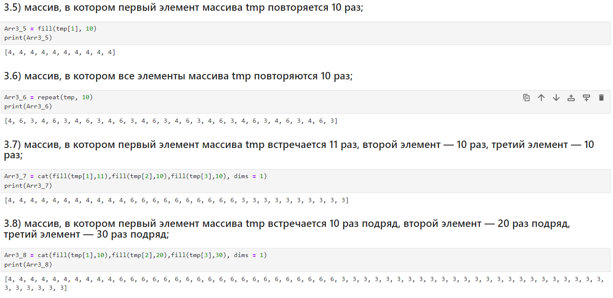

---
## Front matter
lang: ru-RU
title: Лабораторная работа №2. 
subtitle: Структуры данных
author:
  - Тазаева А. А.
institute:
  - Российский университет дружбы народов, Москва, Россия

## i18n babel
babel-lang: russian
babel-otherlangs: english

## Formatting pdf
toc: false
toc-title: Содержание
slide_level: 2
aspectratio: 169
section-titles: true
theme: metropolis
header-includes:
 - \metroset{progressbar=frametitle,sectionpage=progressbar,numbering=fraction}
---

# Цели работы

Изучить несколько структур данных, реализованных в Julia, научиться применять их и операции над ними для решения задач

# Задание

1. Используя Jupyter Lab, повторите примеры из раздела 2.2.
2. Выполните задания для самостоятельной работы (раздел 2.4).

## Кортежи 

{#fig:001 width=70%}

## Кортежи

{#fig:002 width=70%}

## Словари

{#fig:003 width=70%}

## Множества

{#fig:005 width=70%}

## Множества

{#fig:006 width=70%}

## Массивы

{#fig:008 width=70%}

## Массивы

{#fig:011 width=70%}

## Самостоятельная работа

{#fig:017 width=70%}

## Самостоятельная работа

{#fig:018 width=70%}

## Самостоятельная работа

{#fig:019 width=70%}

# Выводы по проделанной работе

В ходе выполнения лабораторной работы я изучила несколько структур данных, реализованных в Julia, научилась применять их и операции над ними для решения задач

