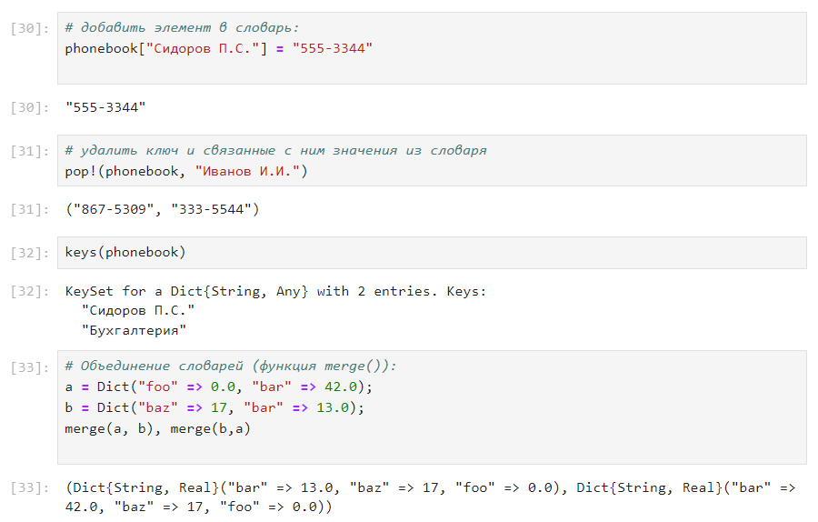
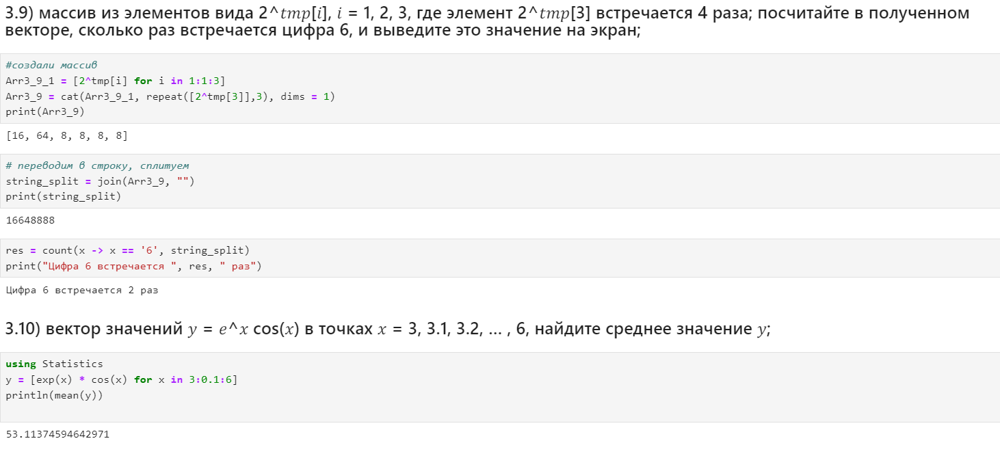

---
## Front matter
title: "Лабораторная работа №2"
subtitle: "Структуры данных"
author: "Тазаева Анастасия Анатольевна"

## Generic otions
lang: ru-RU
toc-title: "Содержание"

## Bibliography
bibliography: bib/cite.bib
csl: pandoc/csl/gost-r-7-0-5-2008-numeric.csl

## Pdf output format
toc: true # Table of contents
toc-depth: 2
lof: true # List of figures
lot: true # List of tables
fontsize: 12pt
linestretch: 1.5
papersize: a4
documentclass: scrreprt
## I18n polyglossia
polyglossia-lang:
  name: russian
  options:
	- spelling=modern
	- babelshorthands=true
polyglossia-otherlangs:
  name: english
## I18n babel
babel-lang: russian
babel-otherlangs: english
## Fonts
mainfont: IBM Plex Serif
romanfont: IBM Plex Serif
sansfont: IBM Plex Sans
monofont: IBM Plex Mono
mathfont: STIX Two Math
mainfontoptions: Ligatures=Common,Ligatures=TeX,Scale=0.94
romanfontoptions: Ligatures=Common,Ligatures=TeX,Scale=0.94
sansfontoptions: Ligatures=Common,Ligatures=TeX,Scale=MatchLowercase,Scale=0.94
monofontoptions: Scale=MatchLowercase,Scale=0.94,FakeStretch=0.9
mathfontoptions:
## Biblatex
biblatex: true
biblio-style: "gost-numeric"
biblatexoptions:
  - parentracker=true
  - backend=biber
  - hyperref=auto
  - language=auto
  - autolang=other*
  - citestyle=gost-numeric
## Pandoc-crossref LaTeX customization
figureTitle: "Рис."
tableTitle: "Таблица"
listingTitle: "Листинг"
lofTitle: "Список иллюстраций"
lotTitle: "Список таблиц"
lolTitle: "Листинги"
## Misc options
indent: true
header-includes:
  - \usepackage{indentfirst}
  - \usepackage{float} # keep figures where there are in the text
  - \floatplacement{figure}{H} # keep figures where there are in the text
---

# Цель работы

Изучить несколько структур данных, реализованных в Julia, научиться применять их и операции над ними для решения задач

# Задание

1. Используя Jupyter Lab, повторите примеры из раздела 2.2.
2. Выполните задания для самостоятельной работы (раздел 2.4).

# Выполнение лабораторной работы

## Кортежи

Кортеж (Tuple) — структура данных (контейнер) в виде неизменяемой индексируемой последовательности элементов какого-либо типа (элементы индексируются с единицы). Синтаксис определения кортежа:

`(element1, element2, ...)`

Примеры представлены на рис. [-@fig:001] и [-@fig:002] :

{#fig:001 width=70%}

{#fig:002 width=70%}

## Словари

Словарь — неупорядоченный набор связанных между собой по ключу данных. Синтаксис определения словаря: 

`Dict(key1 => value1, key2 => value2, ...)`

Примеры представлены на рис. [-@fig:003] и [-@fig:004] :

{#fig:003 width=70%}

{#fig:004 width=70%}

## Множества

Множество , как структура данных в Julia, соответствует множеству, как математическому объекту, то есть является неупорядоченной совокупностью элементов какого-либо типа. Возможные операции над множествами: объединение, пересечение, разность; принадлежность элемента множеству.  Синтаксис определения множества: 

`Set([itr])`, где itr — набор значений, сгенерированных данным итерируемым объектом или пустоемножество.

Примеры представлены на рис. [-@fig:005], [-@fig:006], [-@fig:007]  :

{#fig:005 width=70%}

{#fig:006 width=70%}

{#fig:007 width=70%}

## Массивы

Массив — коллекция упорядоченных элементов, размещённая в многомерной сетке. Векторы и матрицы являются частными случаями массивов.
Общий синтаксис одномерных массивов:
```
array_name_1 = [element1, element2, ...]
array_name_2 = [element1 element2 ...]
```
Некоторые операции для работы с массивами:
- length(A) — число элементов массива A;
- ndims(A) — число размерностей массива A;
- size(A) — кортеж размерностей массива A;
- size(A, n) — размерность массива A в заданном направлении;
- copy(A) — создание копии массива A;
- ones() , zeros() — создать массив с единицами или нулями соответственно;
- fill(value,array_name) — заполнение массива заранее определенным значением;
- sort() — сортировка элементов;
- collect() — вернуть массив всех элементов в коллекции или итераторе;
- reshape() — изменение размера массива;
- transpose() — транспонирование массива;

Примеры массивов представлены на рис. [-@fig:008], [-@fig:009], [-@fig:010]  :

{#fig:008 width=70%}

{#fig:009 width=70%}

{#fig:010 width=70%}

Примеры операций над массивами представлены на рис. [-@fig:011] - [-@fig:016] :

{#fig:011 width=70%}

{#fig:012 width=70%}

{#fig:013 width=70%}

{#fig:014 width=70%}

{#fig:015 width=70%}

{#fig:016 width=70%}

## Самостоятельная работа

Выполнение заданий можно просмотреть на рис. [-@fig:017] - [-@fig:026] :

{#fig:017 width=70%}

{#fig:018 width=70%}

{#fig:019 width=70%}

{#fig:020 width=70%}

{#fig:021 width=70%}

{#fig:022 width=70%}

{#fig:023 width=70%}

{#fig:024 width=70%}

{#fig:025 width=70%}

{#fig:026 width=70%}

# Выводы

В ходе выполнения лабораторной работы я изучила несколько структур данных, реализованных в Julia, научилась применять их и операции над ними для решения задач

