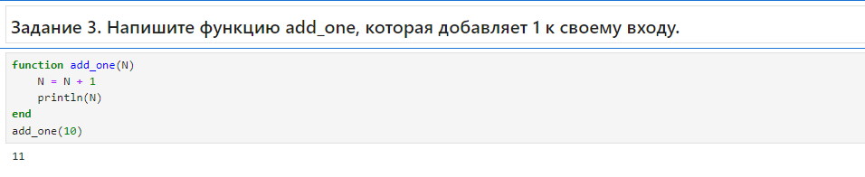

---
## Front matter
lang: ru-RU
title: Лабораторная работа №3. 
subtitle: Управляющие структуры
author:
  - Тазаева А. А.
institute:
  - Российский университет дружбы народов, Москва, Россия

## i18n babel
babel-lang: russian
babel-otherlangs: english

## Formatting pdf
toc: false
toc-title: Содержание
slide_level: 2
aspectratio: 169
section-titles: true
theme: metropolis
header-includes:
 - \metroset{progressbar=frametitle,sectionpage=progressbar,numbering=fraction}
---

# Цели работы

Освоить применение циклов функций и сторонних для Julia пакетов для решения задач линейной алгебры и работы с матрицами.

# Задание

1. Используя Jupyter Lab, повторите примеры из раздела 3.2.
2. Выполните задания для самостоятельной работы (раздел 3.4).

## Циклы while и for 

{#fig:001 width=70%}

## Условные выражения

{#fig:004 width=70%}

## Функции

{#fig:005 width=70%}

## Сторонние библиотеки (пакеты) в Julia

{#fig:009 width=70%}

## Самостоятельная работа

## Самостоятельная работа

{#fig:010 width=70%}

## Самостоятельная работа

{#fig:011 width=70%}

## Самостоятельная работа

{#fig:012 width=70%}

## Самостоятельная работа

{#fig:013 width=70%}

## Самостоятельная работа

{#fig:014 width=70%}

## Самостоятельная работа

{#fig:016 width=70%}

## Самостоятельная работа

{#fig:017 width=70%}

## Самостоятельная работа

{#fig:018 width=70%}

## Самостоятельная работа

{#fig:023 width=70%}

## Самостоятельная работа

{#fig:024 width=70%}

# Выводы по проделанной работе

В ходе лабораторной работы мною было освоено применение циклов функций и сторонних для Julia пакетов для решения задач линейной алгебры и работы с матрицами.

