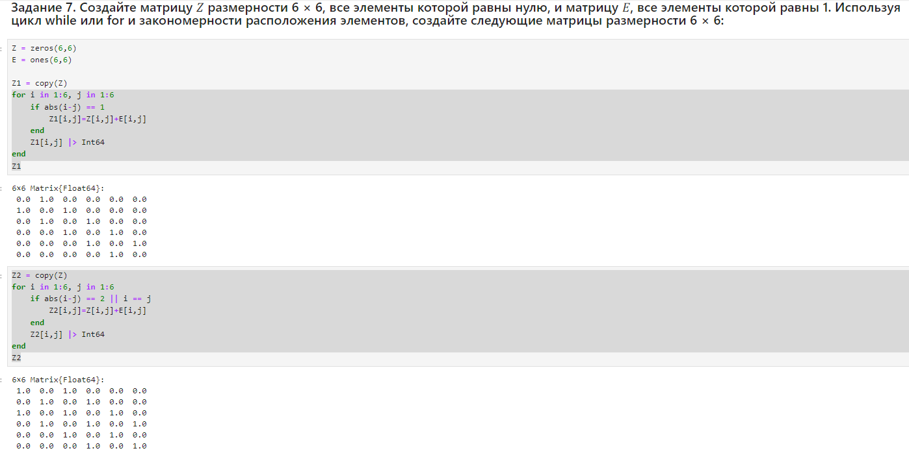

---
## Front matter
title: "Лабораторная работа №3"
subtitle: "Управляющие структуры"
author: "Тазаева Анастасия Анатольевна"

## Generic otions
lang: ru-RU
toc-title: "Содержание"

## Bibliography
bibliography: bib/cite.bib
csl: pandoc/csl/gost-r-7-0-5-2008-numeric.csl

## Pdf output format
toc: true # Table of contents
toc-depth: 2
lof: true # List of figures
lot: true # List of tables
fontsize: 12pt
linestretch: 1.5
papersize: a4
documentclass: scrreprt
## I18n polyglossia
polyglossia-lang:
  name: russian
  options:
	- spelling=modern
	- babelshorthands=true
polyglossia-otherlangs:
  name: english
## I18n babel
babel-lang: russian
babel-otherlangs: english
## Fonts
mainfont: IBM Plex Serif
romanfont: IBM Plex Serif
sansfont: IBM Plex Sans
monofont: IBM Plex Mono
mathfont: STIX Two Math
mainfontoptions: Ligatures=Common,Ligatures=TeX,Scale=0.94
romanfontoptions: Ligatures=Common,Ligatures=TeX,Scale=0.94
sansfontoptions: Ligatures=Common,Ligatures=TeX,Scale=MatchLowercase,Scale=0.94
monofontoptions: Scale=MatchLowercase,Scale=0.94,FakeStretch=0.9
mathfontoptions:
## Biblatex
biblatex: true
biblio-style: "gost-numeric"
biblatexoptions:
  - parentracker=true
  - backend=biber
  - hyperref=auto
  - language=auto
  - autolang=other*
  - citestyle=gost-numeric
## Pandoc-crossref LaTeX customization
figureTitle: "Рис."
tableTitle: "Таблица"
listingTitle: "Листинг"
lofTitle: "Список иллюстраций"
lotTitle: "Список таблиц"
lolTitle: "Листинги"
## Misc options
indent: true
header-includes:
  - \usepackage{indentfirst}
  - \usepackage{float} # keep figures where there are in the text
  - \floatplacement{figure}{H} # keep figures where there are in the text
---

# Цель работы

Освоить применение циклов функций и сторонних для Julia пакетов для решения задач линейной алгебры и работы с матрицами.

# Задание

1. Используя Jupyter Lab, повторите примеры из раздела 3.2.
2. Выполните задания для самостоятельной работы (раздел 3.4).

# Выполнение лабораторной работы

## Циклы while и for

Для различных операций, связанных с перебором индексируемых элементов структур данных, традиционно используются циклы while и for.
Синтаксис while
```
while <условие>
	<тело цикла>
end
```

Примеры представлены на рис. [-@fig:001] - [-@fig:003] :

{#fig:001 width=70%}

{#fig:002 width=70%}

{#fig:003 width=70%}


## Условные выражения

Довольно часто при решении задач требуется проверить выполнение тех или иных условий. Для этого используют условные выражения.
Синтаксис условных выражений с ключевым словом:
```
if <условие 1>
	<действие 1>
elseif <условие 2>
	<действие 2>
else
	<действие 3>
end
```

Примеры представлены на рис. [-@fig:004] :

{#fig:004 width=70%}

## Функции

Julia дает нам несколько разных способов написать функцию. Первый требует ключевых слов function и end :
```
function sayhi(name)
	println("Hi $name, it's great to see you!")
end
function f(x)
x^2
end
```
В качестве альтернативы, можно объявить любую из выше определённых функций в одной строке:

```
sayhi2(name) = println("Hi $name, it's great to see you!")
f2(x) = x^2
```

Наконец, можно объявить выше определённые функции как «анонимные»:

```
sayhi3 = name -> println("Hi $name, it's great to see you!")
f3 = x -> x^2
```

Примеры представлены на рис. [-@fig:005] - [-@fig:008]  :

{#fig:005 width=70%}

{#fig:006 width=70%}

{#fig:007 width=70%}

{#fig:008 width=70%}

## Сторонние библиотеки (пакеты) в Julia

При первом использовании пакета в вашей текущей установке Julia вам необходимо использовать менеджер пакетов, чтобы явно его добавить:
```
import Pkg
Pkg.add("Example")
```

При каждом новом использовании Julia (например, в начале нового сеанса в REPL или открытии блокнота в первый раз) нужно загрузить пакет, используя ключевое слово using.

Примеры представлены на рис. [-@fig:009] :

{#fig:009 width=70%}

## Самостоятельная работа

Выполнение заданий можно просмотреть на рис. [-@fig:010] - [-@fig:024] :

{#fig:010 width=70%}

{#fig:011 width=70%}

{#fig:012 width=70%}

{#fig:013 width=70%}

{#fig:014 width=70%}

{#fig:015 width=70%}

{#fig:016 width=70%}

{#fig:017 width=70%}

{#fig:018 width=70%}

{#fig:019 width=70%}

{#fig:020 width=70%}

{#fig:021 width=70%}

{#fig:022 width=70%}

{#fig:023 width=70%}

{#fig:024 width=70%}

# Выводы

В ходе лабораторной работы мною было освоено применение циклов функций и сторонних для Julia пакетов для решения задач линейной алгебры и работы с матрицами.

