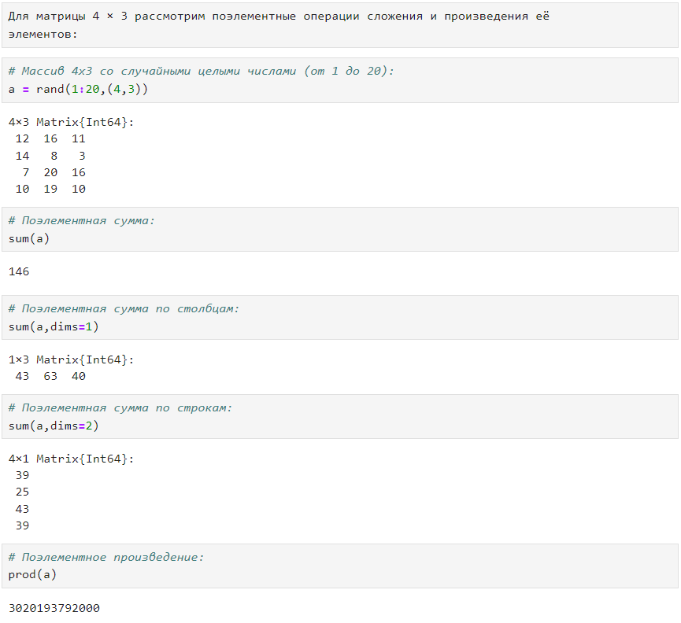
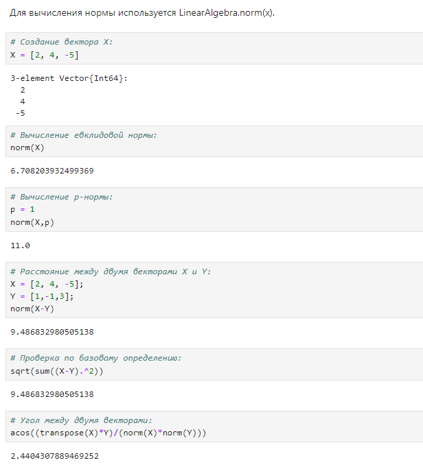
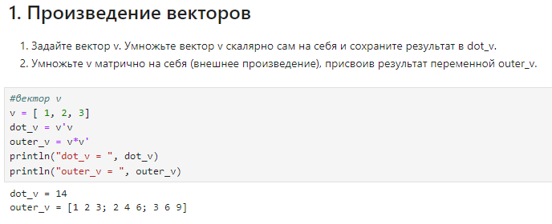
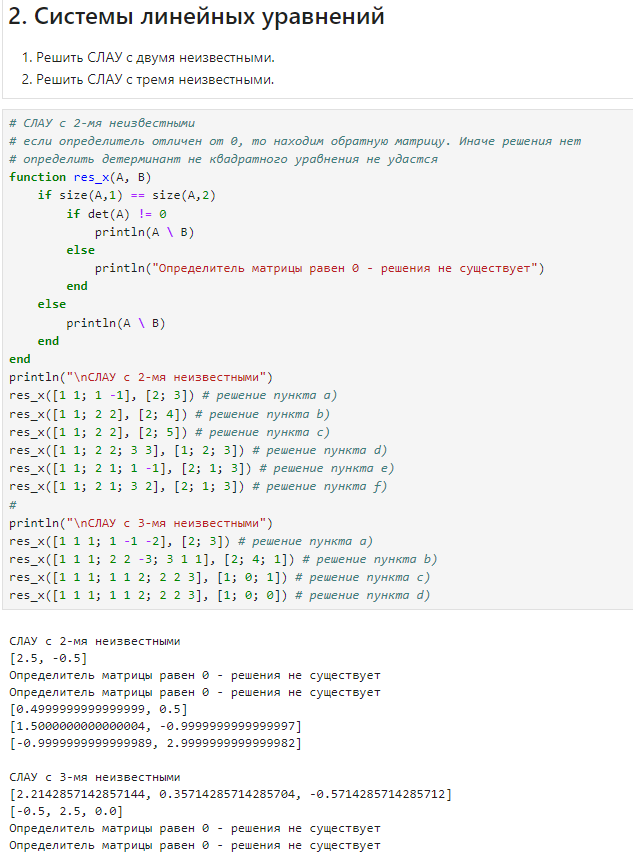
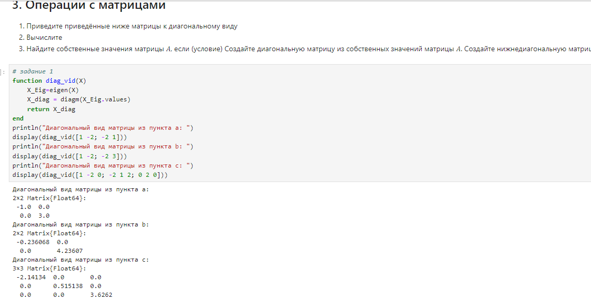
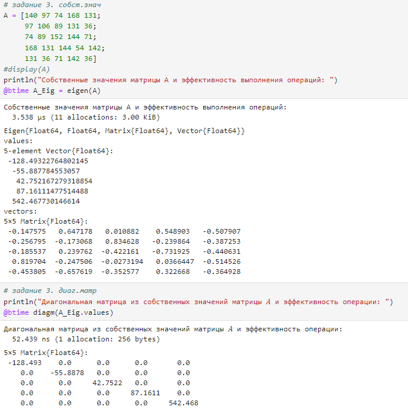

---
## Front matter
lang: ru-RU
title: Лабораторная работа №4. 
subtitle: Линейная алгебра
author:
  - Тазаева А. А.
institute:
  - Российский университет дружбы народов, Москва, Россия

## i18n babel
babel-lang: russian
babel-otherlangs: english

## Formatting pdf
toc: false
toc-title: Содержание
slide_level: 2
aspectratio: 169
section-titles: true
theme: metropolis
header-includes:
 - \metroset{progressbar=frametitle,sectionpage=progressbar,numbering=fraction}
---

# Цели работы

Основной целью работы является изучение возможностей специализированных пакетов Julia для выполнения и оценки эффективности операций над объектами линейной алгебры.

# Задание

1. Используя Jupyter Lab, повторите примеры из раздела 4.2.
2. Выполните задания для самостоятельной работы (раздел 4.4).

## Поэлементные операции над многомерными массивами

{#fig:001 width=70%}

## Транспонирование, след, ранг, определитель и инверсия матрицы

{#fig:003 width=70%}

## Вычисление нормы векторов и матриц, повороты, вращения

{#fig:005 width=70%}

## Матричное умножение, единичная матрица, скалярное произведение

{#fig:007 width=70%}

## Факторизация. Специальные матричные структуры

{#fig:008 width=70%}

## Общая линейная алгебра

{#fig:015 width=70%}

## Самостоятельная работа

{#fig:016 width=70%}

## Самостоятельная работа

{#fig:017 width=70%}

## Самостоятельная работа

{#fig:018 width=70%}

## Самостоятельная работа

{#fig:019 width=70%}

## Самостоятельная работа

{#fig:020 width=70%}

## Самостоятельная работа

{#fig:021 width=70%}

## Самостоятельная работа

{#fig:022 width=70%}

## Самостоятельная работа

{#fig:023 width=70%}

# Выводы по проделанной работе

В ходе лабораторной работы мною были изучены возможности специализированных пакетов Julia для выполнения и оценки эффективности операций над объектами линейной алгебры.

