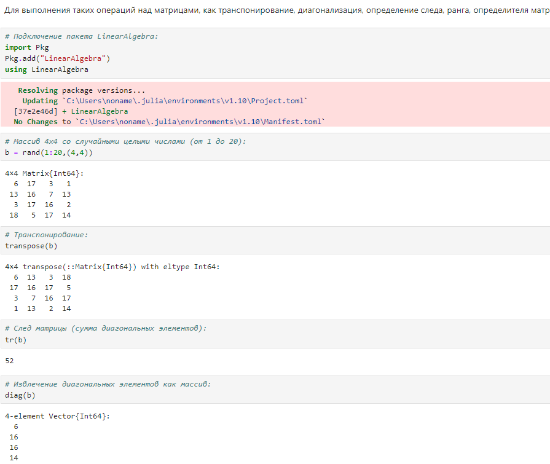

---
## Front matter
title: "Лабораторная работа №4"
subtitle: "Линейная алгебра"
author: "Тазаева Анастасия Анатольевна"

## Generic otions
lang: ru-RU
toc-title: "Содержание"

## Bibliography
bibliography: bib/cite.bib
csl: pandoc/csl/gost-r-7-0-5-2008-numeric.csl

## Pdf output format
toc: true # Table of contents
toc-depth: 2
lof: true # List of figures
lot: true # List of tables
fontsize: 12pt
linestretch: 1.5
papersize: a4
documentclass: scrreprt
## I18n polyglossia
polyglossia-lang:
  name: russian
  options:
	- spelling=modern
	- babelshorthands=true
polyglossia-otherlangs:
  name: english
## I18n babel
babel-lang: russian
babel-otherlangs: english
## Fonts
mainfont: IBM Plex Serif
romanfont: IBM Plex Serif
sansfont: IBM Plex Sans
monofont: IBM Plex Mono
mathfont: STIX Two Math
mainfontoptions: Ligatures=Common,Ligatures=TeX,Scale=0.94
romanfontoptions: Ligatures=Common,Ligatures=TeX,Scale=0.94
sansfontoptions: Ligatures=Common,Ligatures=TeX,Scale=MatchLowercase,Scale=0.94
monofontoptions: Scale=MatchLowercase,Scale=0.94,FakeStretch=0.9
mathfontoptions:
## Biblatex
biblatex: true
biblio-style: "gost-numeric"
biblatexoptions:
  - parentracker=true
  - backend=biber
  - hyperref=auto
  - language=auto
  - autolang=other*
  - citestyle=gost-numeric
## Pandoc-crossref LaTeX customization
figureTitle: "Рис."
tableTitle: "Таблица"
listingTitle: "Листинг"
lofTitle: "Список иллюстраций"
lotTitle: "Список таблиц"
lolTitle: "Листинги"
## Misc options
indent: true
header-includes:
  - \usepackage{indentfirst}
  - \usepackage{float} # keep figures where there are in the text
  - \floatplacement{figure}{H} # keep figures where there are in the text
---

# Цель работы

Основной целью работы является изучение возможностей специализированных пакетов Julia для выполнения и оценки эффективности операций над объектами линейной алгебры.

# Задание

1. Используя Jupyter Lab, повторите примеры из раздела 4.2.
2. Выполните задания для самостоятельной работы (раздел 4.4).

# Выполнение лабораторной работы

## Поэлементные операции над многомерными массивами

Примеры представлены на рис. [-@fig:001] и [-@fig:002] :

{#fig:001 width=70%}

{#fig:002 width=70%}

## Транспонирование, след, ранг, определитель и инверсия матрицы

Для выполнения таких операций над матрицами, как транспонирование, диагонализация, определение следа, ранга, определителя матрицы и т.п. можно воспользоваться библиотекой (пакетом) LinearAlgebra 

Примеры представлены на рис. [-@fig:003] и [-@fig:004] :

{#fig:003 width=70%}

{#fig:004 width=70%}

## Вычисление нормы векторов и матриц, повороты, вращения

Для вычисления нормы используется LinearAlgebra.norm(x) .

Примеры представлены на рис. [-@fig:005], [-@fig:006] :

{#fig:005 width=70%}

{#fig:006 width=70%}

## Матричное умножение, единичная матрица, скалярное произведение

Примеры представлены на рис. [-@fig:007] :

{#fig:007 width=70%}

## Факторизация. Специальные матричные структуры

	В математике факторизация (или разложение) объекта — его декомпозиция (например,числа, полинома или матрицы) в произведение других объектов или факторов, которые, будучи перемноженными, дают исходный объект.
	Матрица может быть факторизована на произведение матриц специального вида для приложений, в которых эта форма удобна. К специальным видам матриц относят ортогональные, унитарные и треугольные матрицы.
	Рассмотрим несколько примеров. Для работы со специальными матричными структурами потребуется пакет LinearAlgebra .

Примеры представлены на рис. [-@fig:008] - [-@fig:014] :

{#fig:008 width=70%}

{#fig:009 width=70%}

{#fig:010 width=70%}

{#fig:011 width=70%}

{#fig:012 width=70%}

{#fig:013 width=70%}

{#fig:014 width=70%}

## Общая линейная алгебра

Обычный способ добавить поддержку числовой линейной алгебры - это обернуть подпрограммы BLAS и LAPACK . Собственно, для матриц с элементами Float32 , Float64 , Complex {Float32} или Complex {Float64} разработчики Julia использовали такое же решение. Однако Julia также поддерживает общую линейную алгебру, что позволяет, например, работать с матрицами и векторами рациональных чисел.
Для задания рационального числа используется двойная косая черта:
1//2

Примеры представлены на рис. [-@fig:015] :

{#fig:015 width=70%}

## Самостоятельная работа

Выполнение заданий можно просмотреть на рис. [-@fig:016] - [-@fig:023] :

{#fig:016 width=70%}

{#fig:017 width=70%}

{#fig:018 width=70%}

{#fig:019 width=70%}

{#fig:020 width=70%}

{#fig:021 width=70%}

{#fig:022 width=70%}

{#fig:023 width=70%}

# Выводы

В ходе лабораторной работы мною были изучены возможности специализированных пакетов Julia для выполнения и оценки эффективности операций над объектами линейной алгебры.

