---
## Front matter
lang: ru-RU
title: Лабораторная работа №5. 
subtitle: Построение графиков
author:
  - Тазаева А. А.
institute:
  - Российский университет дружбы народов, Москва, Россия

## i18n babel
babel-lang: russian
babel-otherlangs: english

## Formatting pdf
toc: false
toc-title: Содержание
slide_level: 2
aspectratio: 169
section-titles: true
theme: metropolis
header-includes:
 - \metroset{progressbar=frametitle,sectionpage=progressbar,numbering=fraction}
---

# Цели работы

Основная цель работы — освоить синтаксис языка Julia для построения графиков.

# Задание

1. Используя Jupyter Lab, повторите примеры из раздела 5.2.
2. Выполните задания для самостоятельной работы (раздел 5.4).

## Установка пакетов 

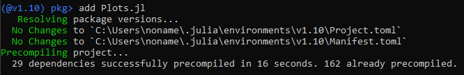{#fig:001 width=70%}

## Основные пакеты для работы с графиками в Julia

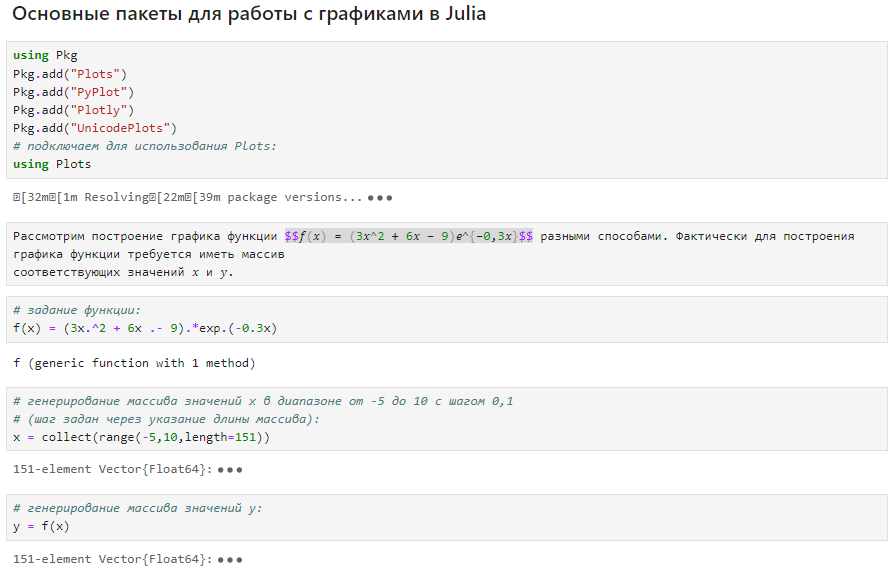{#fig:002 width=70%}

## Самостоятельная работа

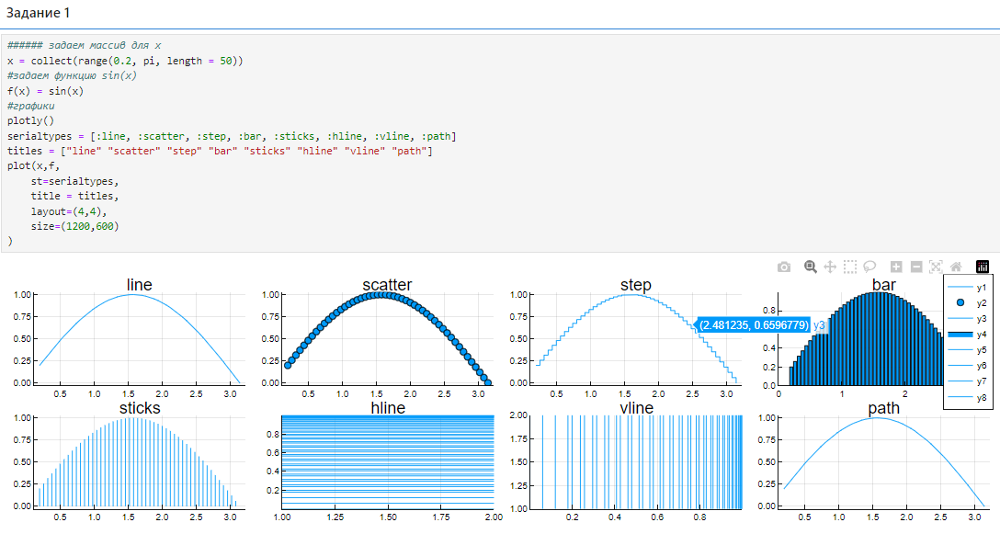{#fig:035 width=70%}

## Самостоятельная работа

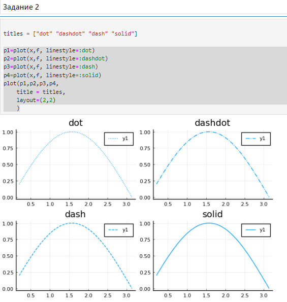{#fig:036 width=70%}

## Самостоятельная работа

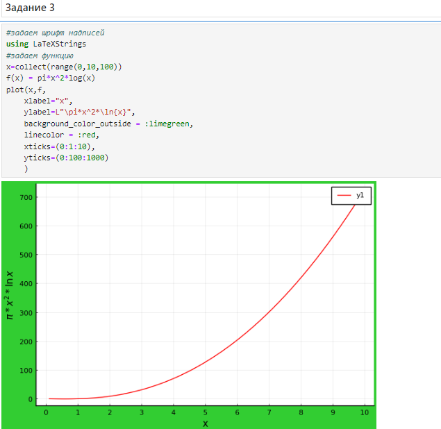{#fig:037 width=70%}

## Самостоятельная работа

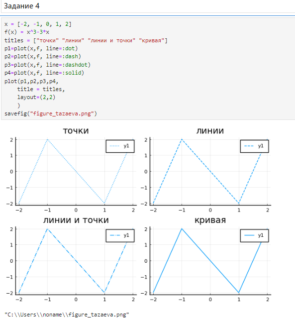{#fig:038 width=70%}

## Самостоятельная работа

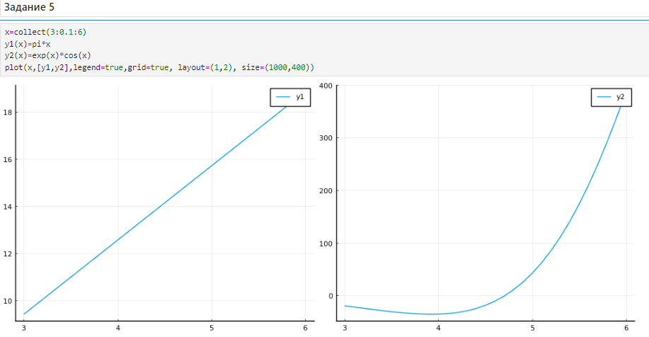{#fig:039 width=70%}

## Самостоятельная работа

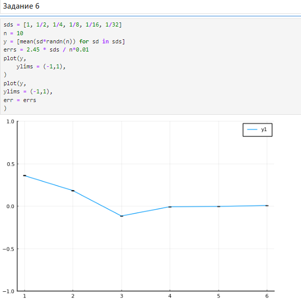{#fig:040 width=70%}

## Самостоятельная работа

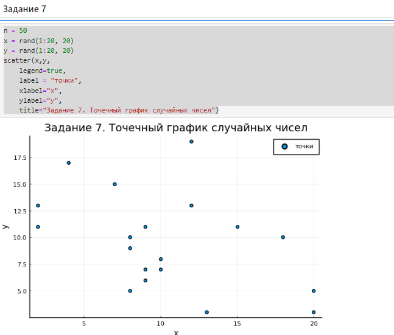{#fig:041 width=70%}

## Самостоятельная работа

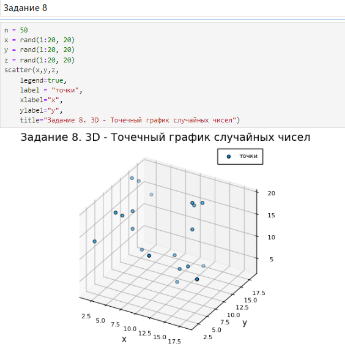{#fig:042 width=70%}

## Самостоятельная работа

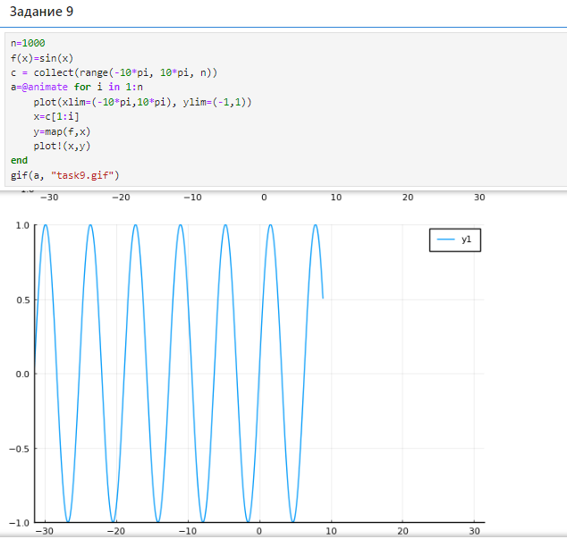{#fig:043 width=70%}

## Самостоятельная работа

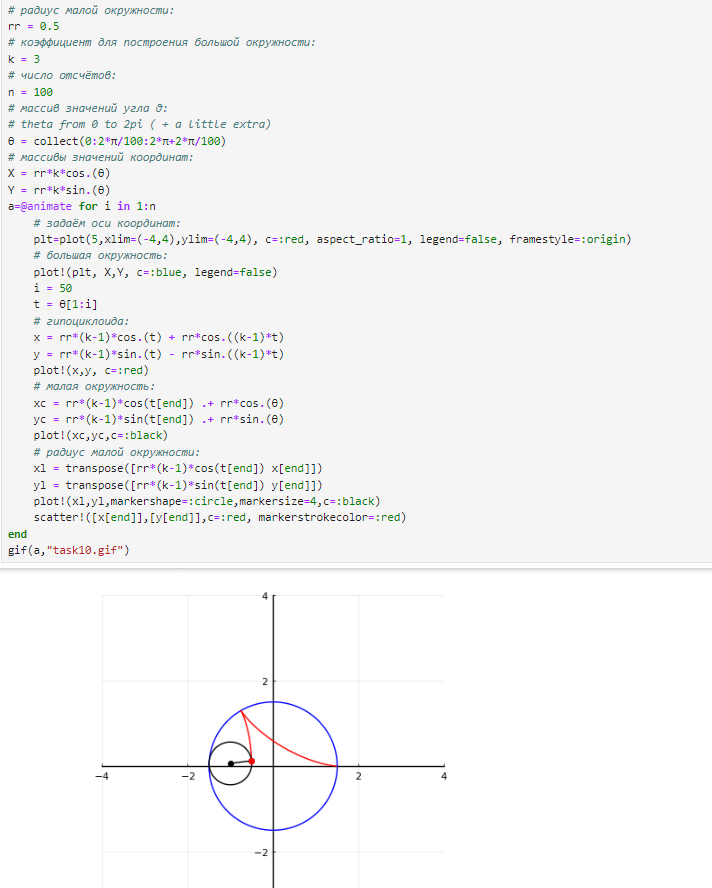{#fig:044 width=70%}

## Самостоятельная работа

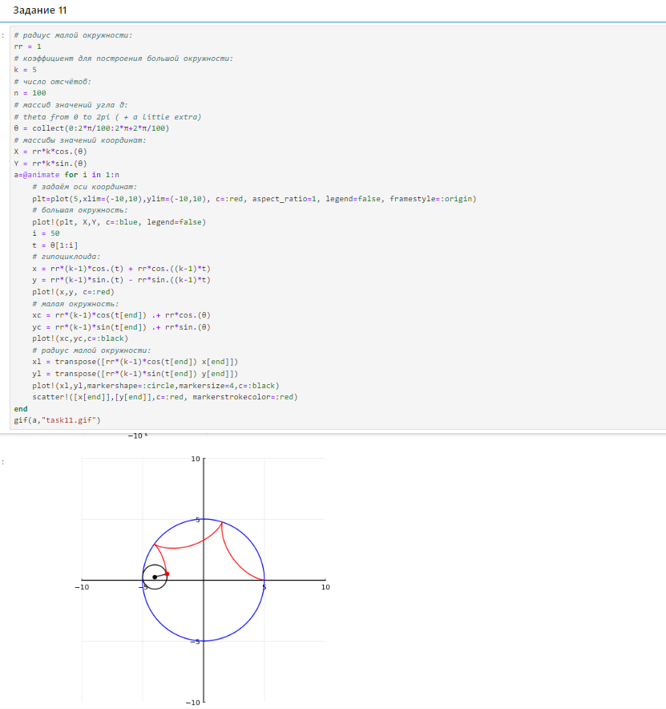{#fig:045 width=70%}

# Выводы по проделанной работе

В ходе лабораторной работы мною был освоен синтаксис языка Julia для построения графиков.

