---
## Front matter
lang: ru-RU
title: Лабораторная работа №7. 
subtitle: Введение в работу с данными
author:
  - Тазаева А. А.
institute:
  - Российский университет дружбы народов, Москва, Россия

## i18n babel
babel-lang: russian
babel-otherlangs: english

## Formatting pdf
toc: false
toc-title: Содержание
slide_level: 2
aspectratio: 169
section-titles: true
theme: metropolis
header-includes:
 - \metroset{progressbar=frametitle,sectionpage=progressbar,numbering=fraction}
---

# Цели работы

Основная цель работы — освоение специализированных пакетов для обработки данных.

# Задание

1. Используя Jupyter Lab, повторите примеры из раздела 7.2.
2. Выполните задания для самостоятельной работы (раздел 7.4).

## Считывание данных

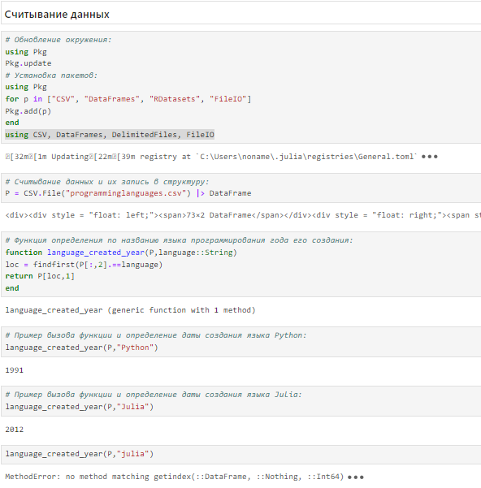{#fig:001 width=70%}

## Считывание данных

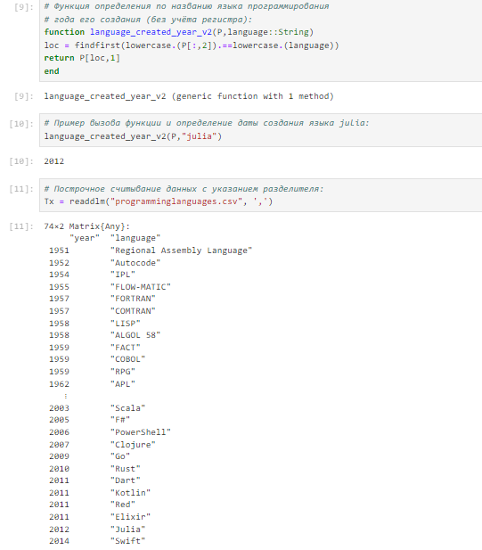{#fig:002 width=70%}

## Словари

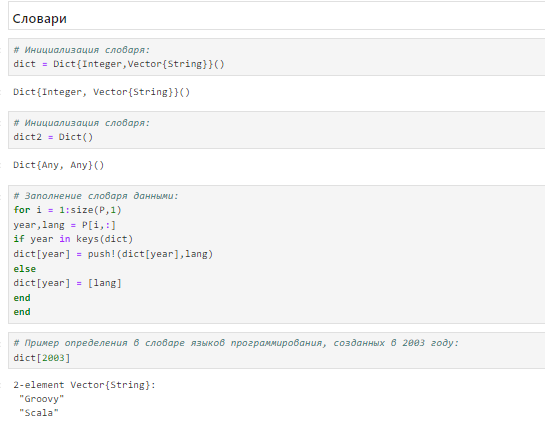{#fig:004 width=70%}

## DataFrames

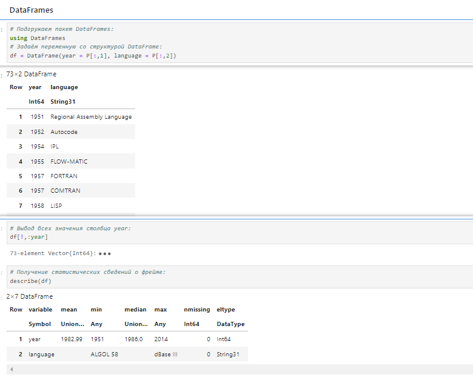{#fig:005 width=70%}

## RDatasets

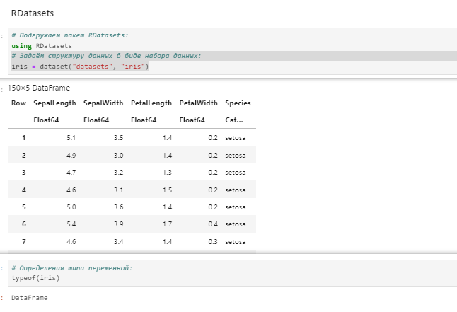{#fig:006 width=70%}

## Missing Values

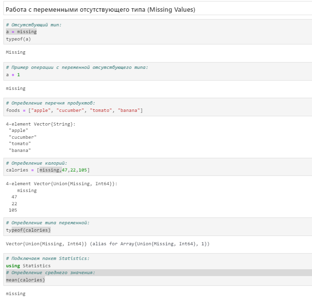{#fig:007 width=70%}

## Кластеризация данных. Метод k-средних.

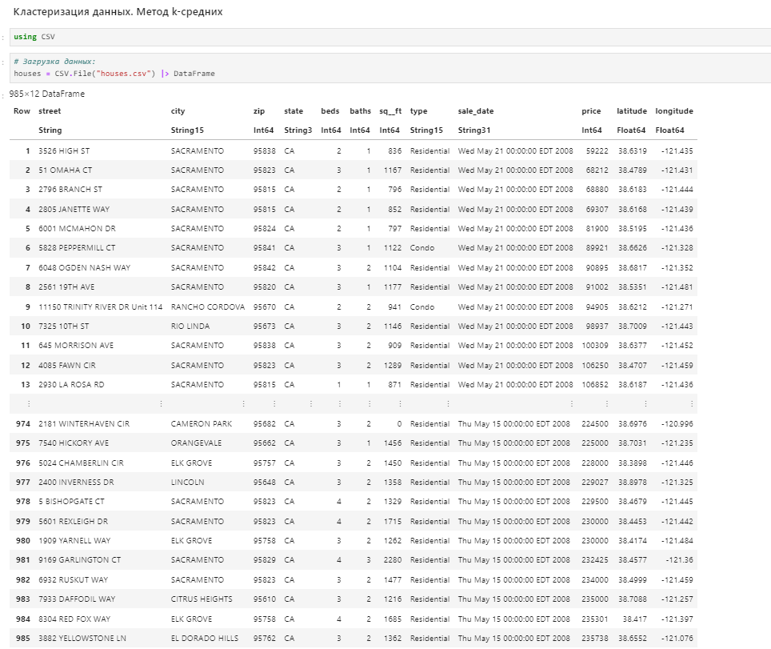{#fig:009 width=70%}

## Кластеризация данных. Метод k-средних.

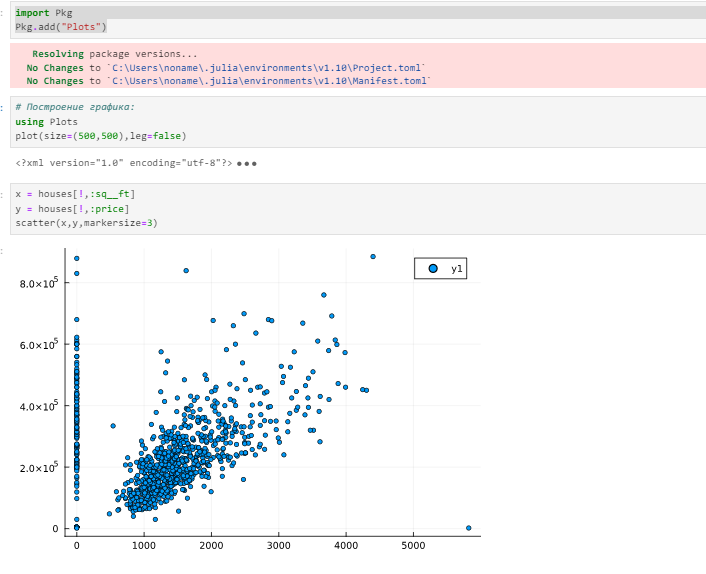{#fig:010 width=70%}

## Кластеризация данных. Метод k-средних.

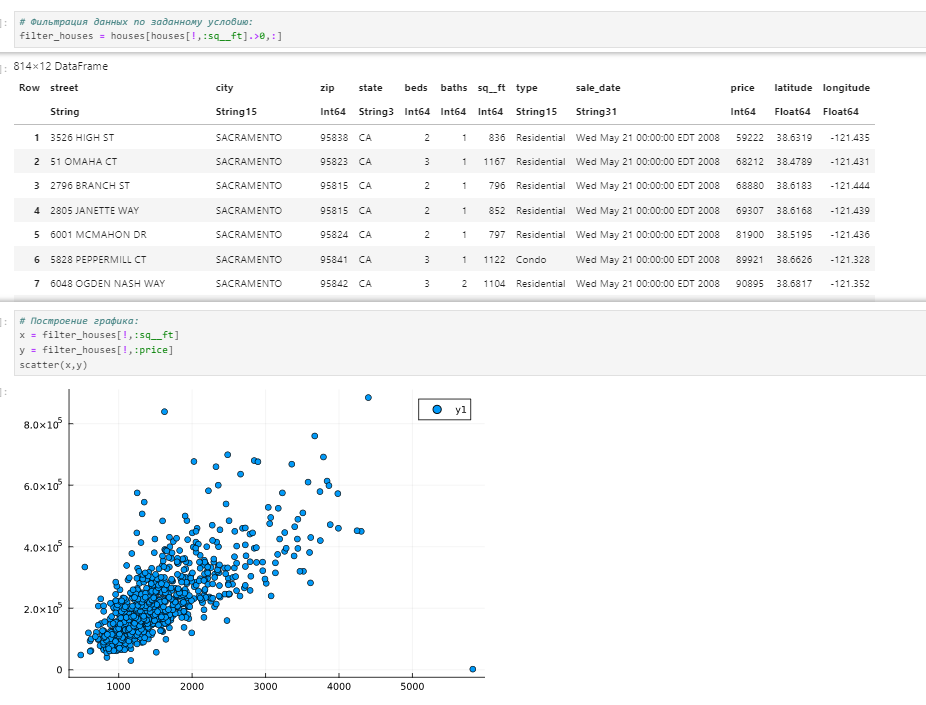{#fig:011 width=70%}

## Кластеризация данных. Метод k-средних.

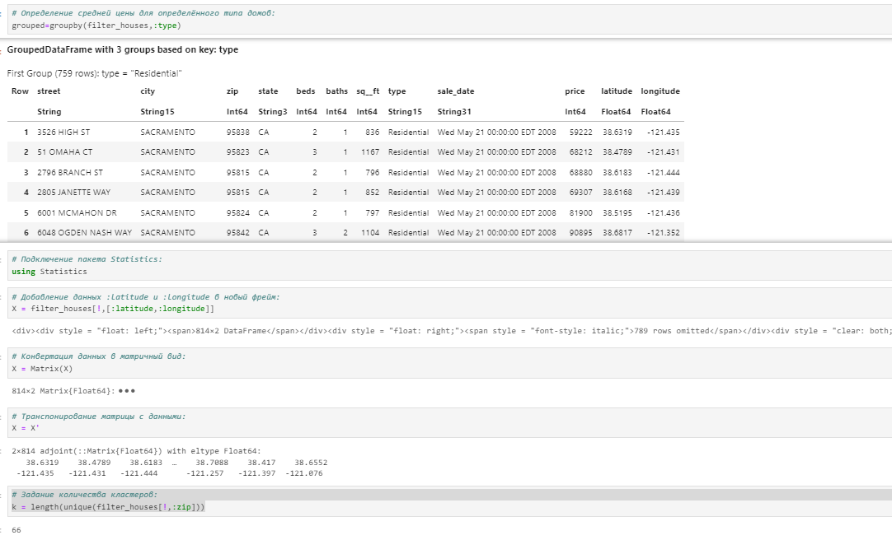{#fig:012 width=70%}

## Кластеризация данных. Метод k ближайших соседей.

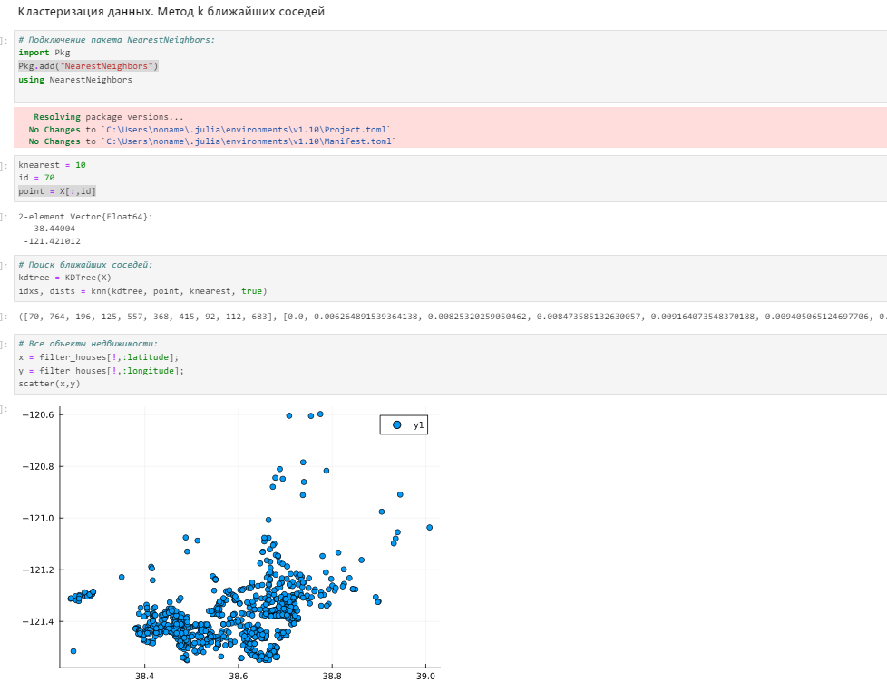{#fig:015 width=70%}

## Кластеризация данных. Метод k ближайших соседей.

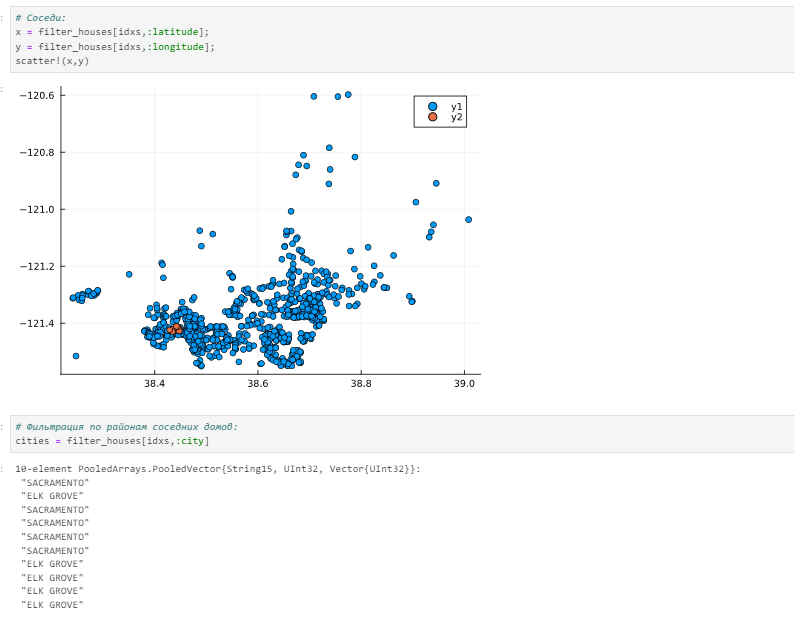{#fig:016 width=70%}

## Кластеризация данных. Метод k ближайших соседей.

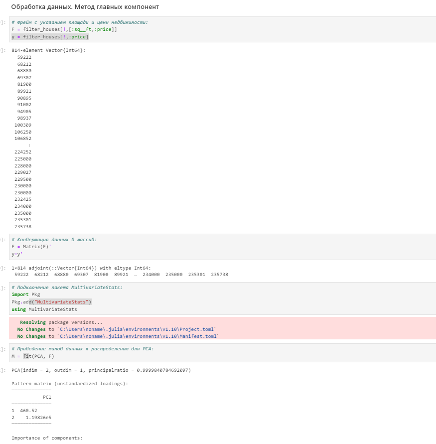{#fig:017 width=70%}

## Кластеризация данных. Метод k ближайших соседей.

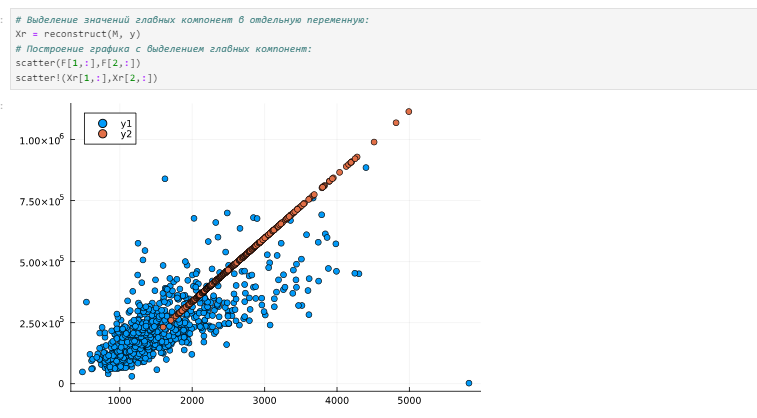{#fig:018 width=70%}

## Обработка данных. Линейная регрессия.

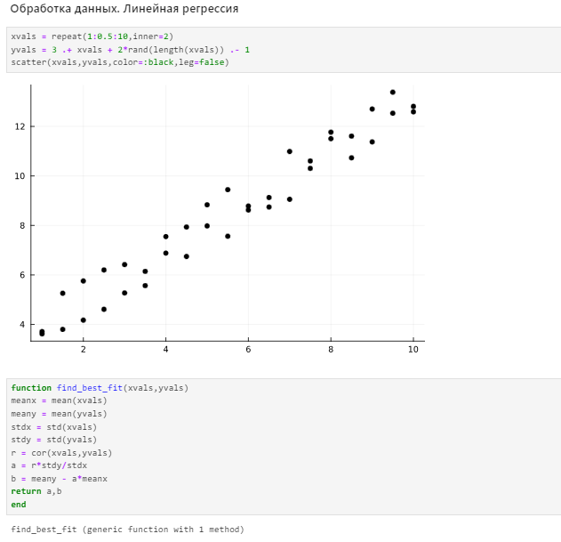{#fig:019 width=70%}

## Обработка данных. Линейная регрессия.

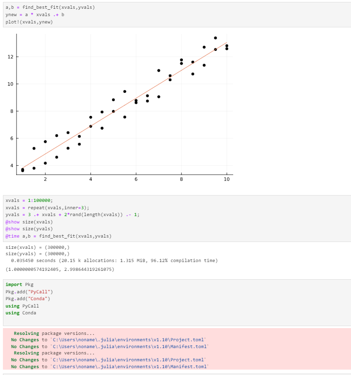{#fig:020 width=70%}

## Обработка данных. Линейная регрессия.

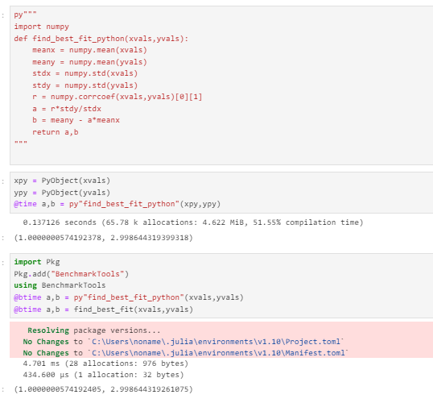{#fig:021 width=70%}

# Выводы по проделанной работе

В ходе лабораторной работы мною были освоены специализированные пакеты для обработки данных.

